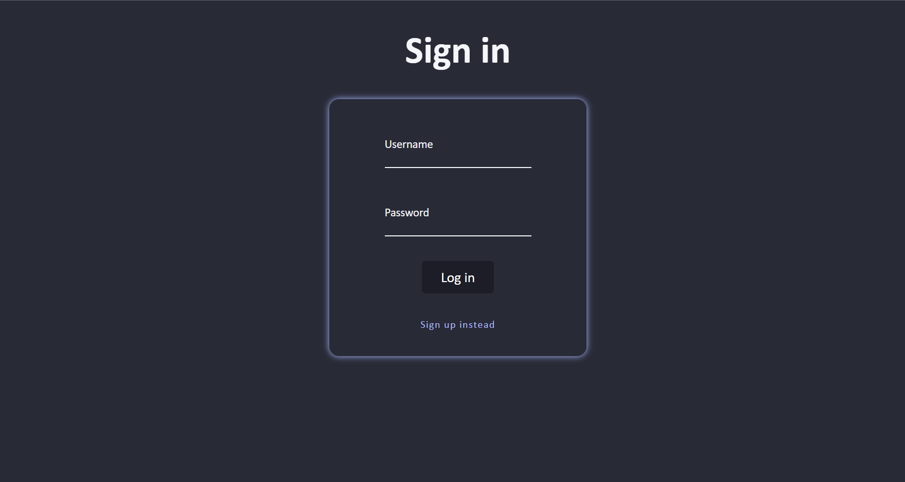
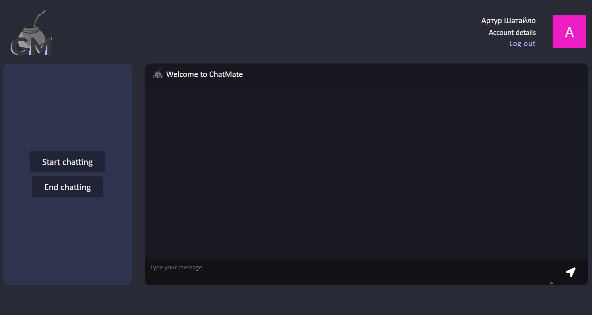
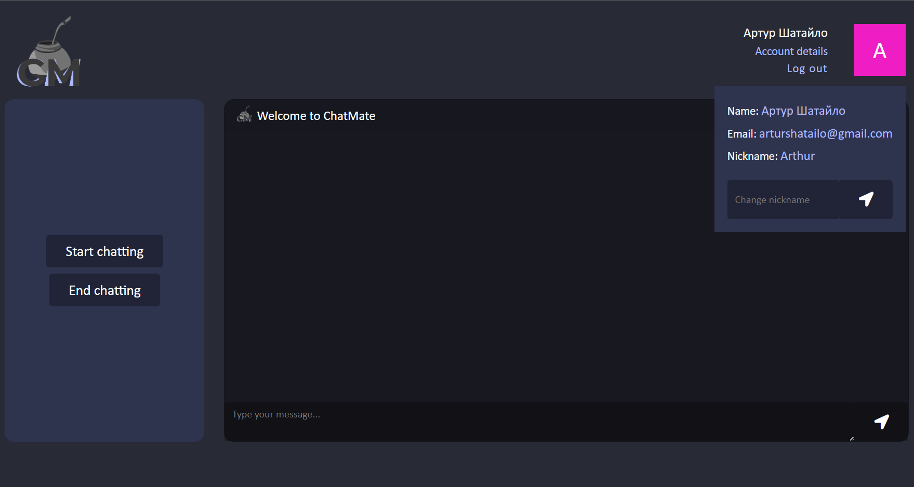
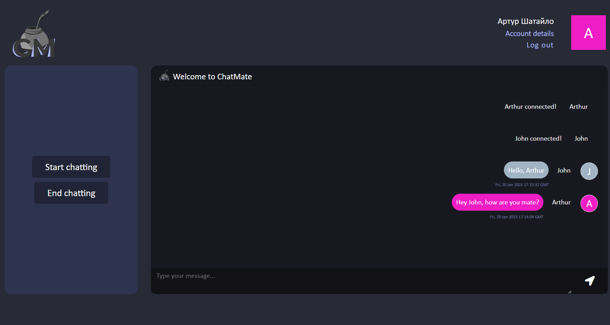
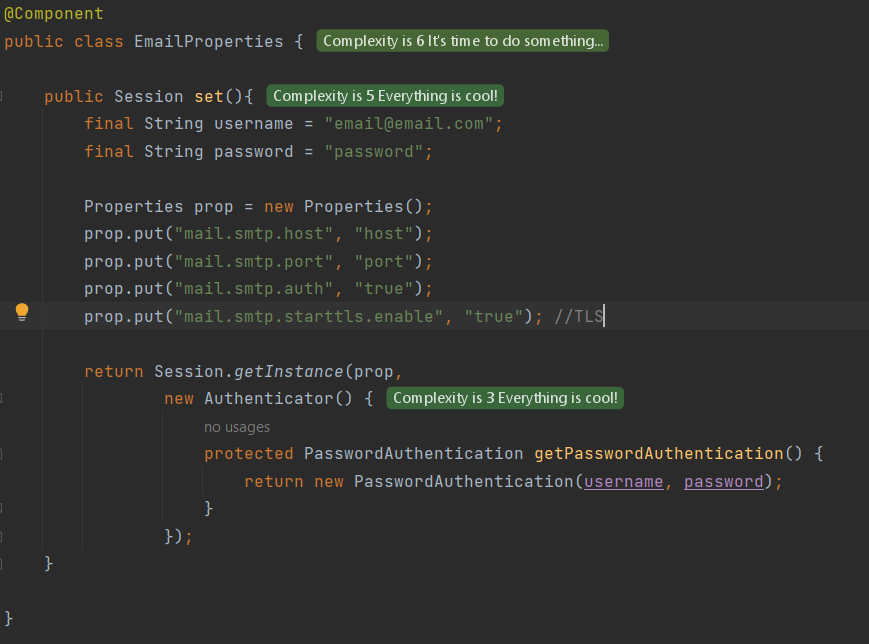

<h1 align="center">WEB CHAT APPLICATION (ChatMate)</h1>

<h4 align="center">
Spring boot web chat application with websocket (SockJS) messaging, Spring Security authentication and 
email registration confirmation. The frontend JavaScript part is also included (HTML + CSS)
</h4>

 <!--spacing 20px-->

<h2>Contents</h2>
<ul>
    <li>
        <a href="#overview">Overview</a>
    </li>
    <li>
        <a href="#technologies-stack">Technologies stack</a>
    </li>
    <li>
        <a href="#demonstration">Demonstration</a>
    </li>
    <li>
        <a href="#how-to-start">How to start</a>
    </li>
</ul>

 <!--spacing 20px-->

<h2 id="overview">Overview</h2>

This is a web chat application ChatMate that can be used to chatting with another connected users.

The fist step any user should pass through is the authentication and authorisation process that is provided by Spring Security configuration. 
Then, using post request, a new user record will be saved in database as well as a new registration token. This token is needed to confirm the emeil. 
An email message will be sent to user's specified email address and a 15 minutes period token will be included in the inner mail link, so user should 
just click on it and email address will be confirmed according to the token. Registration process is completed.  
Now, user can use the username (email) and password to sign in the system and get access to the secured page of chat. 
Dashboard page (chat page) includes personal information of the user received by fetch request to backend api with get request. The legged in user is abel 
to change its nickname at any time. Also, on the dashboard page the chat window is displayed and can be used to connect, disconnect and message sending/receiving. 
Each new connected user will be displayed in the chat window, also, the event message will be sent when any user is disconnecting. 
When user disconnects from the chat, messages from another user will not be received anymore. 
Message sending process is provided by SockJS with STOMP (simple text oriented message protocol) and backend configured WebSocketMessageBroker.

The application can be tested using the link to AWS: <a href="http://chat-mate.us-east-1.elasticbeanstalk.com/">ChatMate</a>

 <!--spacing 20px-->

<h2 id="technologies-stack">Technologies stack</h2>
<ul>
    <li>
        
Spring Boot

    </li>
    <li>
        
Spring Security

    </li>
    <li>
        
Spring Mail

    </li>
    <li>
        
PostgreSQL database

    </li>
    <li>
        
WebSocket messaging

    </li>
    <li>
        
JavaScript + HTML + CSS(SCSS)

    </li>
    <li>
        
SockJS, Stomp

    </li>
    <li>
        
Lombok, Slf4j

    </li>
    <li>
        
Maven

    </li>
    <li>
        
Deployed to AWS

    </li>
    <!--<li>
        
JUnit and Mockito

    </li>-->
    
</ul>

 <!--spacing 20px-->

<h2 id="demonstration">Demonstration</h2>
<ul>
    <li>
        
LOGIN <b>http://localhost:8095/login</b>

        

            Login form connected to Spring Security
        

        
    </li>

 <!--spacing 10px-->
    <li>
        
REGISTRATION <b>http://localhost:8095/register</b>

        

            Registration form connected to Spring Security and Confirmation email sender
        

        
    </li>

 <!--spacing 10px-->
    <li>
        
DASHBOARD <b>http://localhost:8095/dashboard</b>

        

            Dashboard page with user interface.
        

        
    </li>

 <!--spacing 10px-->
    <li>
        
PERSONAL INFORMATION <b>http://localhost:8095/dashboard</b>

        

            User information displayed from the fetch GET request to endpoint http://localhost:8095/api/user
        

        
    </li>

 <!--spacing 10px-->
    
CHATTING <b>http://localhost:8095/dashboard</b>

        

            Chat messaging with SockJS requests to /chat endpoint. Messages are displayed according to the user information: 
            generated avatar, nickname, generated message body that includes inputted message text. 
        

        
</ul>

 <!--spacing 20px-->

<h2 id="how-to-start">How to start</h2>

Download the project from GitHub (using fork is appreciated)

Start the app in your IDE (don't forget about database configuration)

Email confirmation configuration file example is attached below

Go to the link: http://localhost:8095/login

 <!--spacing 10px-->

 <!--spacing 20px-->